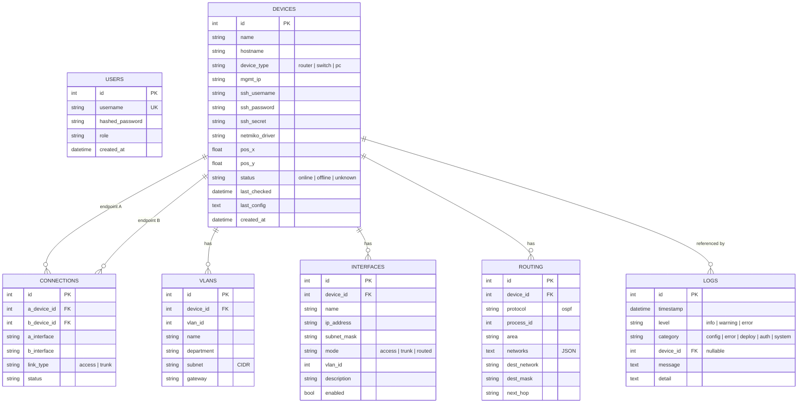

# ER Diagram — MVP (7 tables)

Render this with any Mermaid viewer (VS Code "Markdown Preview Mermaid", mermaid.live,
GitHub) and export to `ERDiagram.png` for the thesis.

```mermaid
erDiagram
    USERS {
        int id PK
        string username UK
        string hashed_password
        string role
        datetime created_at
    }

    DEVICES {
        int id PK
        string name
        string hostname
        string device_type "router | switch | pc"
        string mgmt_ip
        string ssh_username
        string ssh_password
        string ssh_secret
        string netmiko_driver
        float pos_x
        float pos_y
        string status "online | offline | unknown"
        datetime last_checked
        text last_config
        datetime created_at
    }

    CONNECTIONS {
        int id PK
        int a_device_id FK
        int b_device_id FK
        string a_interface
        string b_interface
        string link_type "access | trunk"
        string status
    }

    VLANS {
        int id PK
        int device_id FK
        int vlan_id
        string name
        string department
        string subnet "CIDR"
        string gateway
    }

    INTERFACES {
        int id PK
        int device_id FK
        string name
        string ip_address
        string subnet_mask
        string mode "access | trunk | routed"
        int vlan_id
        string description
        bool enabled
    }

    ROUTING {
        int id PK
        int device_id FK
        string protocol "ospf"
        int process_id
        string area
        text networks "JSON"
        string dest_network
        string dest_mask
        string next_hop
    }

    LOGS {
        int id PK
        datetime timestamp
        string level "info | warning | error"
        string category "config | error | deploy | auth | system"
        int device_id FK "nullable"
        text message
        text detail
    }

    DEVICES ||--o{ CONNECTIONS : "endpoint A"
    DEVICES ||--o{ CONNECTIONS : "endpoint B"
    DEVICES ||--o{ VLANS : has
    DEVICES ||--o{ INTERFACES : has
    DEVICES ||--o{ ROUTING : has
    DEVICES ||--o{ LOGS : "referenced by"
```
